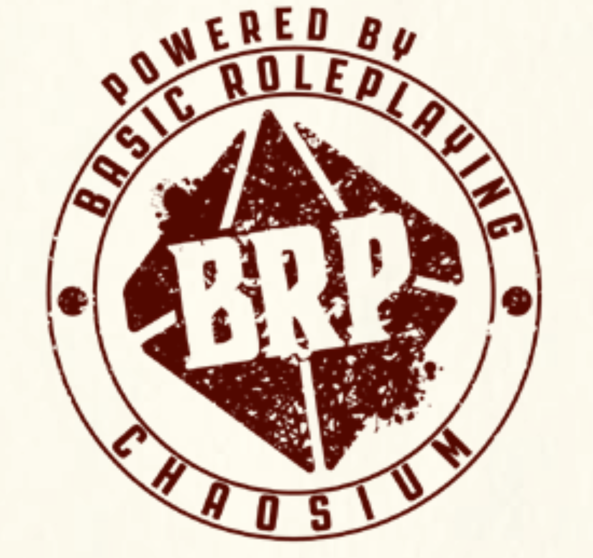

# BasicRoleplaying
Open source code relevant to Chaosium's Basic Roleplaying RPG system.

# Table of Contents
1. [Why Basic Roleplaying?](#why-basic-roleplaying)
2. [What you can find on this repository](#what-you-can-find-on-this-repository)
	1. [Combat Sim](#combat-sim)
	2. [Compendium Tools](#compendium-tools)
3. [For more information on Basic Roleplaying](#more)

## Why Basic Roleplaying? <a name="why-basic-roleplaying">

Though the company is new, we at Astrolabe Tools have for decades had a love for tabletop
roleplaying games (RPGs). Unfortunately, most of these are traditionally encumbered with
strong copyright and trademark protection which makes it very difficult for us to
contribute to the game system ourselves without further balkanizing a product space with
yet another game system or third party campaign setting, incompatible with your game. 

> _For example, if we wanted to write a character sheet app for Hasbro's Dungeons and 
Dragons(TM) product, we could only include the basic weapons in the Systems Reference
Document, which includes only a small subset of the classes, backgrounds, monsters and
items in the core rule books. Basically, that would be anything that might come in the
traditional "red box" starter set, which is mostly enough to play through level 3,
possibly limiting yourself to just the pre-rolled characters inside._

This leaves most 3rd party tabletop RPG software woefully incomplete and would do the same
to ours. The player in search of a full gaming experience has little recourse but to
search the internet for "unofficial" and legally dubious compendia of missing content in
obvious copyright violation, making for terrible player experience. We want noting to do
with that!

> _While we fully support the author's right to protect their intellectual property,
the zeal to stem the encroachment of computer RPGs on ttRPG intellectual property
historically spills over into the space occupied by those who want to write computer tools
to facilitate traditional tabletop play, leading to the depressing array of wounded and
disabled third party software available today. There is, of course, always the officially
licensed D&D Beyond(TM) product and plugins for VTT programs which frankly we use ourselves
at home for lack of a better alternative, but we find them a bit flat and slow to progress
with few, if any, complete tools for traditional tabletop, theater-of-the-mind play to use
instead._

**Enter Basic Roleplaying!**  Chaosium has very kindly open sourced the ruleset behind many 
of their great products, including the #2 most played RPG, Call of Cthulhu(TM), as Basic
Roleplaying under the ORC license. Even better, they did not opt to keep back 95% of the 
content under the reserved content exclusion. (We wish new products like DC20(TM) would do
the same. Perhaps they haven't gotten around to it yet, or don't realize that nearly
everything is reserved content by default.)  So, with Basic Roleplaying, we can actually
ship full featured and complete content with the software!  

Obviously, there is still a great deal of game-specific reserved content particular to
specific games like Call of Cthulhu(TM) which is not ORC licensed, but we feel this is
open enough that we can participate fully, and what is more make our own content on top
where the established 1st party works are evidently incomplete, as intended.  It is a
better universe to work in because the creative opportunities are greater.  Is there a BRP
compatible "monster folio" that includes giant rats? No. Not that we can find anyway. So,
if we want, we can make one and include giant rats in our software. Everyone benefits!

Finally, the crunchiness of the BRP system makes for more interesting games. However, 
crunchiness also more often than not means longer turns, making software gaming aids 
like digital character sheets that aim to speed things up more impactful. For example, in
combat, there are a lot of rules to wade through in Basic Roleplaying. Combat is dangerous
and lethal, giving you more reason to avoid it. There is a lot more we can do here to
speed up gameplay with a software product than we can for more popular and simplified
gaming systems. We need an open SRD to make that shine, and that is what Chaossium has
given us in Basic Roleplaying.
 
Thank you! 

## What you can find on this repository  <a name="what-you-can-find-on-this-repository">
 
We intend to put tools for BRP development here. They will all be under the MIT license
so you can hack on them as you like. If you feel you have something particularly good 
to add, you can file a pull request and maybe if we like it, we will even pull it in.

#### Combat sim <a name="combat-sim">
We are working on a "monster folio" product of our own in our spare time, but realized 
that the game system doesn't include a good way to rate monsters so that a game keeper can
accurately decide whether or not the critters are likely to be a boring cake-walk, or 
result in a total party kill, or hopefully somewhere in between. So, we're looking at 
adding a combat simulator that will help us correlate RPG stats against survival probability
so that we can score the monsters. Obviously, we can't account for players being clever,
but we can simulate what happens if the party stupidly goes toe to toe with the opponent
shotgun and saber to fang and tentacle. We will use this to include a toughness rating for
critters and mechanism and method for accounting for numbers and surprise turns.

#### Compendium tools <a name="compendium-tools">
We are also working on an editor for a compendium that reads and writes from Plist files. 
It will embed formatted text and images as data objects, and provide standardized ways to
give equipment, skills and spells modifiers which may directly impact the game mechanics.
We are looking at ways to make this available as a open source static library.  The GUI
version we will put on a OS platform store near you, but the code to correctly read and
write the file format will go here (and there).  This will ultimately be compatible with
our Mechanus(SM) product, (unreleased). However, there is no reason why you can't use it
with your own stuff.

>_What is Mechanus(SM)?  Mechanus is born out of my frustration with incomplete digital
character sheets which always seem to be missing the one critical feature I need. For
example, the one I used to use a lot inexplicably forgot about Barbarian Rage. It 
just needed a button to add extra damage and other features when the character is raging
and turn it off when not. Since the feature wasn't there, then the user has to make this
adjustment himself. "I rolled a 16, so I miss -- except I am raging so that actually hits!"_
MmmHrmmm, right Joe. Are you sure that bonus wasn't in there already? _"Oh wait, I forgot
about rage last turn, can we ret-con that last round and add in the extra damage? Do I
re-roll?" It's really better if everything just works._

>_Obviously, I can't automate everything because you will have custom classes, new rules
extensions will be released, special items, etc. Such heterogeneity is ten times as likely
with something like Basic Roleplaying which is designed to have other rules systems and
extensions layered on top of it and already has many such. So, what I've done is add a
user editable computation engine where you can add your own controls to turn on and off
features like rage, and adjust the computations behind the game mechanics to include them.
It is a bit like editing forumla in a spreadsheet but without the grid.  That isn't all. 
We'll save most of the splash for the announcement._

#### Other stuff?
We'll see!

## For more information on Basic Roleplaying <a name="more">
Basic Roleplaying is a tabletop RPG system compatible with RuneQuest(TM), World of
Wonder(TM), Call of Cthulhu(TM), Pendragon(TM), Superworld(TM), and is the basis of other
works such as Drukar och Demoner. The system features a D100 (percentile roll) as the 
basis for determining the outcome of chance based events in the game, such as checking
to see whether a skill worked or a weapon hit. The player attempts to roll below the 
relevant skill percentage with appropriate modifiers and difficulty adjustments. This is 
then graded into a critical success, special success, success, failure or fumble, possibly
compared against a competitive counter roll (e.g. an attempt to parry) and the outcome 
determined according to one of many tables, or the story telling acumen of the game master.
Like other table top RPGs, Basic Roleplaying is ultimately a medium for collaborative 
story telling with deep roots in classical wargames that simulate combat.  

For complete information on the Basic Roleplaying system, the primary source is the 
[Basic Roleplaying Universal Game Engine](https://www.chaosium.com/basic-roleplaying/)
rulebook by Jason Durall and Steve Perrin. 

RuneQuest(TM), World of Wonder(TM), Call of Cthulhu(TM), Pendragon(TM), Superworld(TM),
and Drukar och Demoner(TM) are trademarks of their respective rights holders and are not
property of Astrolabe Tools, Inc.  The Basic Roleplaying System is licensed under the ORC
License held in the Library of Congress at TX-307-067 and available online at various
locations including www.chaosium. com/orclicense, www.azoralaw.com/orclicense,
www.gencon.com/orclicense and others. All warranties are disclaimed as set forth therein.
The Basic Roleplaying System is the original work of Chaosium.

